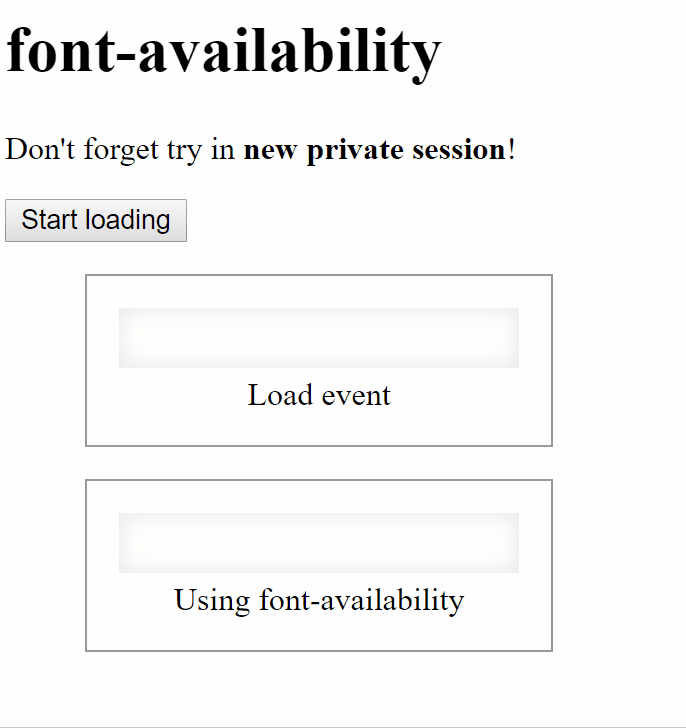

# [WIP] [font-availability](https://github.com/ginpei/font-availability)

Wait until a font is actually available.



# Why?

You can use web fonts really easily by just adding links to CSS files into your HTML statically or dynamically.
The problem is that you don't know when the fonts are actually available.

`load` event is in your mind?
No.
It fires not when *a font* is loaded, but *a CSS* is loaded.

# Usage

## Basic

```js
const fontAvailability = require('font-availability')

fontAvailability.waitFor('Your Font Family')
  .then(_ => {
    console.log('The font is available!')
  })
```

## Instance

Try to use [Slackey](https://fonts.google.com/specimen/Slackey) by Google Fonts dynamically.

```html
<canvas id="the-canvas"></canvas>
```

```js
const fontAvailability = require('font-availability')

const fontFamily = 'Slackey'
const url = 'https://fonts.googleapis.com/css?family=Slackey'

// start loading the font
const elLink = document.createElement('link')
elLink.href = url
elLink.rel = 'stylesheet'
document.body.appendChild(elLink)

// wait
fontAvailability.waitFor(fontFamily)
  .then(_ => {
    // then render on a canvas
    const elCanvas = document.querySelector('#the-canvas')
    const ctx = elCanvas.getContext('2d')
    ctx.font = `20px/20px ${fontFamily}, serif`
    ctx.fillText('Hello World!', 15, 22)
  })
```

# References

## `p = fontAvailability.waitFor(fontFamily)`

- {string} `fontFamily`
- returns {Promise}

## `available = fontAvailability.isAvailable(fontFamily)`

- {string} `fontFamily`
- returns {boolean} `true` if the font is available at that time.

## `fontAvailability.Promise = null`

Fallback for environments which does not support Promise. I mean Internet Explorer.

- [Can I use... Support tables for HTML5, CSS3, etc](https://caniuse.com/#feat=promises)

**TODO: prepare example codes**

# License

MIT

# Author and Contacts

- Created by [Ginpei](https://ginpei.info)
- Twitter [@ginpei_en](https://twitter.com/ginpei_en)
- GitHub [@ginpei](https://github.com/ginpei)

## Issues

Please report here:

- https://github.com/ginpei/font-availability/issues
